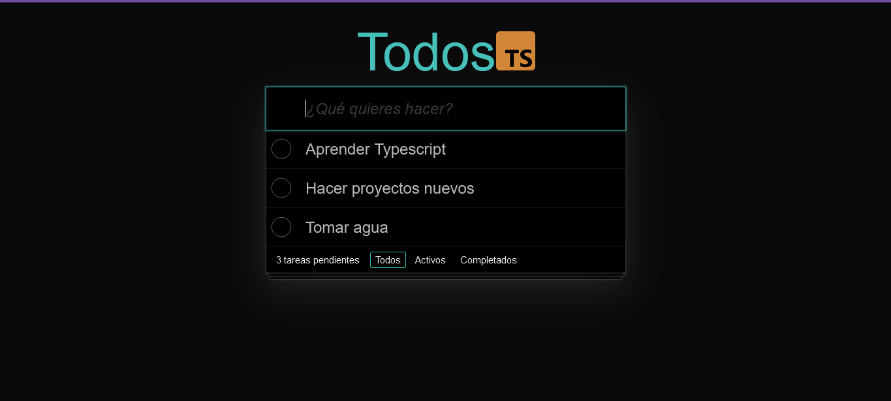
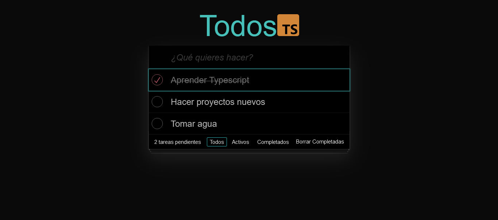
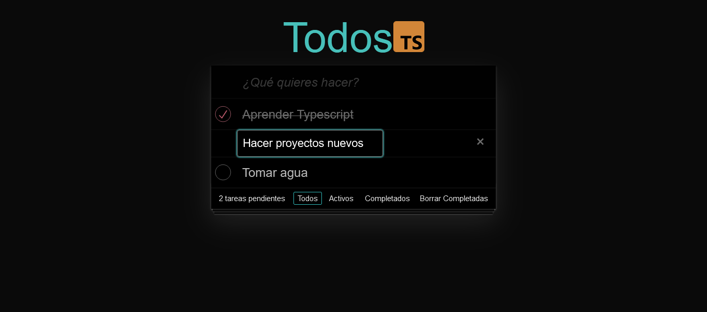
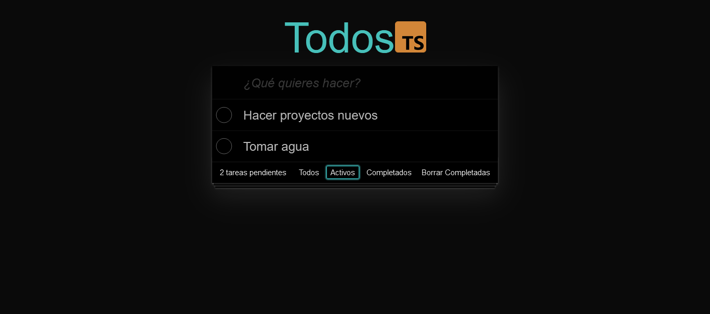
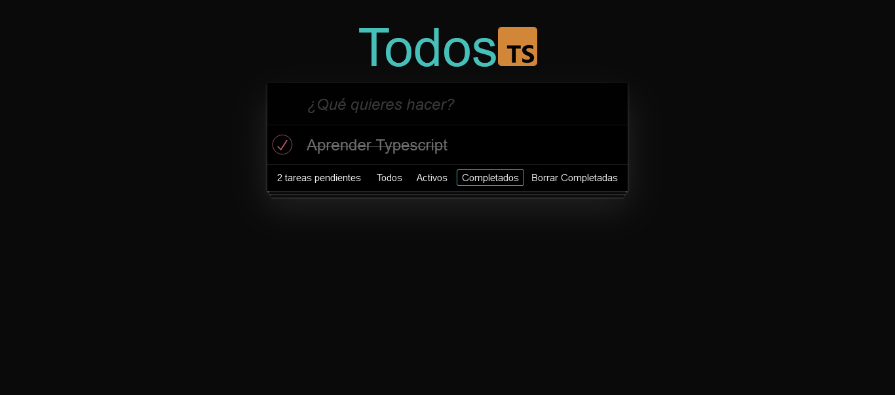

# Todo -> React + TypeScript + Vite

#### Esta es una app para poder organizar tus tareas diarias.

#### Realizada utilizando TypeScript, React y Vite.

## Pantalla de Inicio:

#### Podes visualizar las tareas cargadas y en el input podes cargar nuevas.

#### También haciendo click en el checkbox de cada tarea podes marcarla como completada

#### Tenes la posibilidad de editar las tareas cargadas o eliminarlas

#### En el footer tenes el número de tareas pendientes y los botones para el filtrado por completadas y activas

### Les dejo el link al deploy y espero que les guste!

### https://to-do-typescript-psi.vercel.app/
